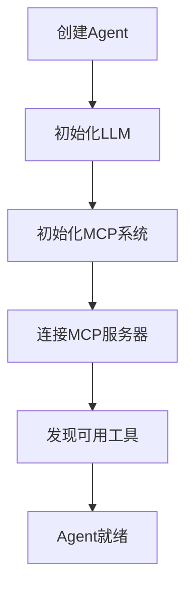
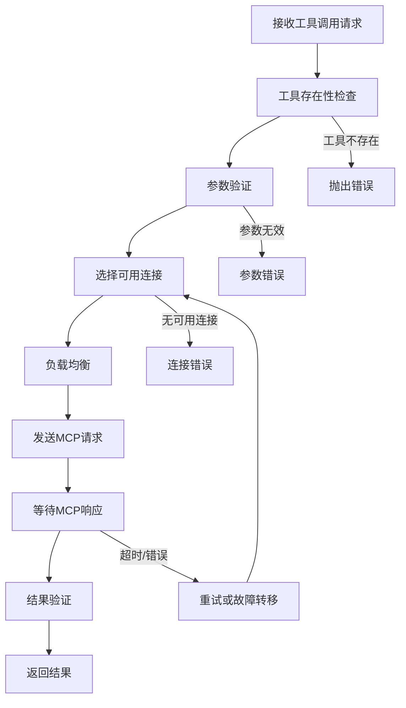
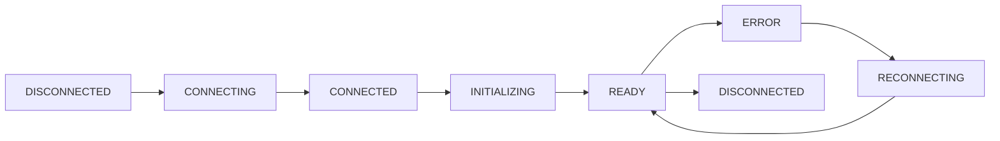

# Agent-Core MCP集成后的运行流程详解

## 🔄 核心运行流程概览

```
用户请求 → AgentCore → 任务分析 → 执行引擎 → MCP/LLM → 结果聚合 → 返回响应
    ↓           ↓          ↓          ↓           ↓          ↓          ↓
 输入解析   初始化检查   任务路由   实际执行   外部调用   结果处理   最终输出
```

## 🏗️ 架构层次

### 1. 用户交互层
```javascript
// 用户调用方式
const agent = await createSmartAgent({...});
const result = await agent.execute({
  type: 'hybrid',
  workflow: [...]
});
```

### 2. AgentCore 核心层
```javascript
// 主要组件
AgentCore {
  llm: LLM,                    // LLM处理器
  mcpSystem: MCPSystem,        // MCP系统
  promptBuilder: PromptBuilder, // Prompt构建器
  eventEmitter: EventEmitter   // 事件系统
}
```

### 3. MCP系统层
```javascript
// MCP组件架构
MCPSystem {
  connectionManager: MCPConnectionManager,  // 连接管理
  toolSystem: MCPToolSystem,               // 工具系统
  clients: Map<string, MCPClient>          // 客户端池
}
```

### 4. 外部服务层
```
MCP服务器 (stdio/HTTP) ← → MCPClient ← → ConnectionManager
```

## 🔀 详细执行流程

### 阶段1: 初始化流程



**代码流程**:
```javascript
// 1. 创建Agent实例
const agent = new AgentCore(config);

// 2. 初始化过程
await agent.initialize() {
  // 2.1 初始化LLM
  this.llm = new LLM(config.llm);
  
  // 2.2 初始化MCP系统
  this.mcpSystem = createMCPSystem(config.mcp);
  await this.mcpSystem.initialize();
  
  // 2.3 建立MCP连接
  // MCPConnectionManager.initialize()
  //   → 连接所有配置的MCP服务器
  //   → 进行协议握手
  //   → 发现可用工具
}
```

### 阶段2: 任务执行流程

#### 2.1 任务类型路由

```javascript
agent.execute(task) {
  switch(task.type) {
    case 'llm':         return this.executeLLMTask(task);
    case 'mcp_tool':    return this.executeMCPToolTask(task);
    case 'mcp_chain':   return this.executeMCPChainTask(task);
    case 'hybrid':      return this.executeHybridTask(task);
    case 'chat':        return this.executeChatTask(task);
    default:            return this.executeDefaultTask(task);
  }
}
```

#### 2.2 各种任务类型的具体流程

**A. LLM任务流程**
```
用户输入 → Prompt构建 → LLM调用 → 响应处理 → 返回结果
```

**B. MCP工具任务流程**
```
用户输入 → 工具验证 → 参数处理 → MCP调用 → 结果解析 → 返回结果
```

**C. MCP工具链任务流程**
```
用户输入 → 工具链解析 → 逐步执行 → 数据传递 → 结果聚合 → 返回结果
      ↓
   工具1 → 工具2 → 工具3 → ... → 最终结果
```

**D. 混合任务流程（最复杂）**
```
用户输入 → 工作流解析 → 步骤执行引擎 → 结果整合 → 最终处理 → 返回结果
      ↓
   步骤1(MCP) → 步骤2(LLM) → 步骤3(MCP) → ... → 最终LLM处理
```

### 阶段3: MCP工具调用详细流程



**代码实现**:
```javascript
async callTool(toolName, args) {
  // 1. 工具验证
  if (!this.toolRegistry.has(toolName)) {
    throw new Error(`Tool '${toolName}' not found`);
  }
  
  // 2. 参数验证
  const tool = this.toolRegistry.get(toolName);
  this.validateArgs(args, tool.inputSchema);
  
  // 3. 获取连接
  const connection = await this.connectionManager.getConnection();
  
  // 4. 构建请求
  const request = createJsonRpcRequest('tools/call', {
    name: toolName,
    arguments: args
  });
  
  // 5. 发送请求
  const response = await connection.client.sendRequest(request);
  
  // 6. 处理响应
  return this.processToolResponse(response);
}
```

## 🔄 混合任务执行详解

混合任务是MCP集成后最强大的功能，让我详细解释其执行流程：

### 混合任务配置示例
```javascript
{
  type: 'hybrid',
  initialPrompt: {
    messages: [{ role: 'user', content: '分析网站内容并生成报告' }]
  },
  workflow: [
    {
      type: 'mcp_tool',
      name: 'fetchPage',
      toolName: 'fetch_page',
      args: { url: 'https://example.com' }
    },
    {
      type: 'mcp_tool', 
      name: 'extractText',
      toolName: 'extract_text',
      args: (data) => ({ html: data.fetchPage.content })
    },
    {
      type: 'llm',
      name: 'analyze',
      prompt: (data) => ({
        messages: [
          { role: 'system', content: '你是内容分析专家' },
          { role: 'user', content: `分析文本: ${data.extractText.text}` }
        ]
      })
    },
    {
      type: 'mcp_tool',
      name: 'saveReport', 
      toolName: 'write_file',
      args: (data) => ({
        path: '/tmp/report.md',
        content: data.analyze
      })
    }
  ],
  finalPrompt: (data) => ({
    messages: [
      { role: 'user', content: `生成执行摘要: ${data.analyze}` }
    ]
  })
}
```

### 混合任务执行步骤

```javascript
async executeHybridTask(task) {
  const executionData = {};
  
  // 1. 执行初始Prompt (可选)
  if (task.initialPrompt) {
    executionData.initialResponse = await this.llm.generateResponse(task.initialPrompt);
  }
  
  // 2. 逐步执行工作流
  for (const step of task.workflow) {
    switch (step.type) {
      case 'mcp_tool':
        // 2a. 解析参数 (支持动态参数)
        const args = typeof step.args === 'function' 
          ? step.args(executionData) 
          : step.args;
          
        // 2b. 调用MCP工具
        const toolResult = await this.mcpSystem.callTool(step.toolName, args);
        executionData[step.name] = toolResult;
        break;
        
      case 'llm':
        // 2c. 构建动态Prompt
        const prompt = typeof step.prompt === 'function'
          ? step.prompt(executionData)
          : step.prompt;
          
        // 2d. 调用LLM
        const llmResult = await this.llm.generateResponse(prompt);
        executionData[step.name] = llmResult.content;
        break;
    }
  }
  
  // 3. 执行最终Prompt (可选)
  let finalResult = executionData;
  if (task.finalPrompt) {
    const finalPrompt = typeof task.finalPrompt === 'function'
      ? task.finalPrompt(executionData)
      : task.finalPrompt;
    finalResult = await this.llm.generateResponse(finalPrompt);
  }
  
  return {
    success: true,
    data: finalResult,
    executionData: executionData
  };
}
```

## 🔌 连接管理和负载均衡

### 连接生命周期


### 负载均衡策略
```javascript
// 1. 轮询 (Round-Robin)
getConnectionRoundRobin() {
  this.roundRobinIndex = (this.roundRobinIndex + 1) % readyConnections.length;
  return readyConnections[this.roundRobinIndex];
}

// 2. 随机 (Random)
getConnectionRandom() {
  const randomIndex = Math.floor(Math.random() * readyConnections.length);
  return readyConnections[randomIndex];
}

// 3. 最少连接 (Least Connections)
getConnectionLeastConnections() {
  return readyConnections.reduce((min, conn) => 
    conn.requestCount < min.requestCount ? conn : min
  );
}
```

## 📊 事件系统和监控

### 事件流
```javascript
// Agent执行过程中的事件流
agent.on('mcpConnectionChanged', (event) => {
  console.log(`连接 ${event.name} 状态变更: ${event.status}`);
});

agent.on('mcpToolCalled', (event) => {
  console.log(`工具调用: ${event.toolName}, 耗时: ${event.duration}ms`);
});

agent.on('taskStarted', (event) => {
  console.log(`任务开始: ${event.type}`);
});

agent.on('taskCompleted', (event) => {
  console.log(`任务完成: ${event.type}, 结果: ${event.success}`);
});
```

### 监控指标
```javascript
// 系统状态监控
const status = agent.getMCPStatus();
/*
{
  healthy: true,
  totalConnections: 3,
  readyConnections: 2,
  connections: {
    'web-server': { status: 'READY', requestCount: 15 },
    'file-server': { status: 'READY', requestCount: 8 }
  },
  tools: {
    totalTools: 12,
    metrics: { callCount: 45, avgDuration: 234 }
  }
}
*/
```

## 🚀 性能优化特性

### 1. 连接复用
- 维持长连接，避免重复握手
- 连接池管理，支持并发请求

### 2. 智能路由
- 健康检查，自动排除故障服务器
- 负载均衡，分散请求压力

### 3. 错误恢复
- 自动重试机制
- 故障转移到备用服务器
- 优雅降级处理

### 4. 缓存优化
- 工具元数据缓存
- 连接状态缓存
- 响应结果缓存（可选）

## 🔄 完整的端到端执行示例

```javascript
// 1. 创建Agent
const agent = await createSmartAgent({
  llm: { provider: 'openai', model: 'gpt-4' },
  mcp: { servers: [{ name: 'web', transport: 'stdio', command: 'web-server' }] }
});

// 2. 执行混合任务
const result = await agent.execute({
  type: 'hybrid',
  workflow: [
    // 步骤1: 获取网页内容 (MCP)
    { type: 'mcp_tool', name: 'fetch', toolName: 'fetch_page', args: { url: 'https://news.com' } },
    
    // 步骤2: 分析内容 (LLM)  
    { type: 'llm', name: 'analyze', prompt: (data) => `分析这个新闻: ${data.fetch.content}` },
    
    // 步骤3: 保存分析结果 (MCP)
    { type: 'mcp_tool', name: 'save', toolName: 'write_file', args: (data) => ({ 
      path: '/tmp/analysis.txt', content: data.analyze 
    })}
  ]
});

// 执行流程:
// Agent.execute() 
//   → executeHybridTask()
//     → mcpSystem.callTool('fetch_page') 
//       → connectionManager.getConnection()
//       → mcpClient.sendRequest()
//       → 返回网页内容
//     → llm.generateResponse() 
//       → 发送到OpenAI API
//       → 返回分析结果  
//     → mcpSystem.callTool('write_file')
//       → 保存文件
//   → 返回完整结果
```

## 💡 总结

MCP集成后的agent具备了以下核心能力：

1. **真实外部服务调用**: 不再是模拟，而是真正调用外部MCP服务
2. **混合智能工作流**: LLM推理 + MCP工具调用的完美结合  
3. **企业级可靠性**: 连接池、负载均衡、故障转移
4. **事件驱动架构**: 实时监控和状态管理
5. **灵活扩展性**: 支持任意MCP服务器和工具

这使得agent-core从一个LLM包装器升级为一个真正的智能代理平台！🚀
